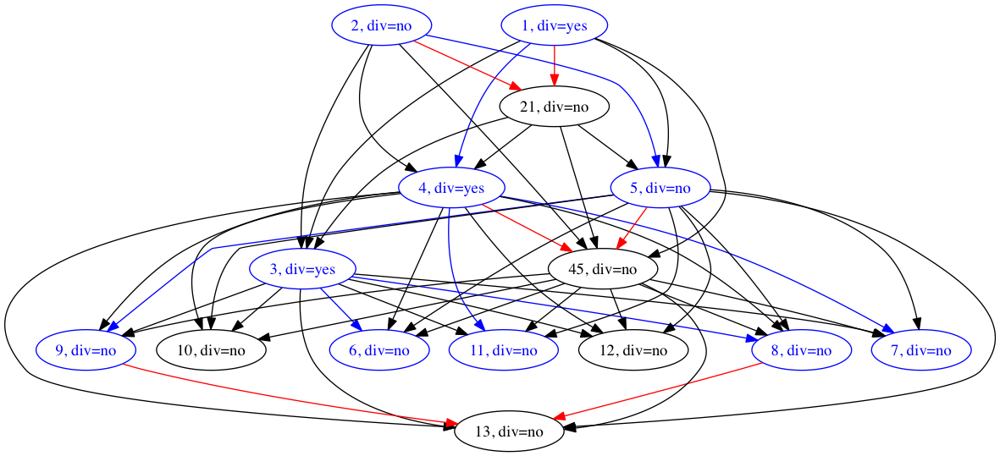

# Multi Hypothesis Tracking
by Carsten Haubold, 2015

This is a standalone tool for running tracking of divisible objects, with competing detection hypotheses in each frame. When specifying a ground truth labeling for a dataset, the weights can be learned using structured learning (by [OpenGM's](http://github.com/opengm/opengm) implementation of [SBMRM](https://github.com/funkey/sbmrm)). The tracking problem is then solved as ILP by Gurobi or CPLEX, depending on how this tool was compiled.

## Installation

### Conda

You can install the python module of this package within a conda environment using one of the following lines, depending on whether you locally have CPLEX or GUROBI installed.

    CPLEX_ROOT_DIR=/path/to/my/CPLEX/ conda install multi-hypotheses-tracking-with-cplex -c chaubold -c ilastik
	GUROBI_ROOT_DIR=/path/to/my/Gurobi/mac64 conda install multi-hypotheses-tracking-with-gurobi -c chaubold -c ilastik

### Manual compilation

Requirements: 

* a compiler capable of C++11 (clang or GCC >= 4.8)
* cmake >= 2.8 for configuration (e.g. `brew install cmake`)
* [opengm](https://github.com/opengm/opengm)'s learning-experimental branch: https://github.com/opengm/opengm/tree/learning-experimental.
* boost (e.g. `brew install boost`)
* hdf5 (e.g. `brew tap homebrew/science; brew install hdf5`)

If you want to parse the JSON files with comments, use e.g. [commentjson](https://pypi.python.org/pypi/commentjson/) for python, or [Jackson](https://github.com/FasterXML/jackson-core/wiki/JsonParser-Features) for Java.


## Binaries

The `bin` folder contains the tools that can be run from the command line. 
All of the tools use JSON file formats as input and output (see below). Invoke them once to see usage instructions.

* `train`: given a graph and the corresponding ground truth, return the best weights
* `track`: given a graph and weights, return the best tracking result
* `validate`: given a graph and a solution, check whether it violates any constraints (useful when creating a ground truth)
* `printgraph`: given a graph (and optionally a solution), draw the graph with graphviz dot (see below)


**Example:**
```
$ ls
>>> gt.json	track	Makefile	model.json	train

$ ./train -m model.json -g gt.json -w weights.json
>>> lots of output...

$ ./track -m model.json -w weights.json -o trackingresult.json
>>> lots of output...

$ ./validate -m model.json -s trackingresult.json
>>> ...output...
>>> Is solution valid? yes

$ ./printgraph -m model.json -s trackingresult.json -o mygraph.dot
$ dot -Tpdf mygraph.dot > mygraph.pdf
$ open mygraph.pdf
```

Or if you want to use it from python, you can create the model and weight as dictionaries (exactly same structure as the JSON format) and then in python run the following:

```python
import multiHypoTracking_with_gurobi as mht

mymodel = {...}
myweights = {"weights": [10,10,500,500]}
result = mht.track(mymodel, myweights)
```

## JSON file formats

* Graph description: [test/magic.json](test/magic.json)
	- there are two ways how weights and features work together: the same weight can be used as multiplier on the i'th feature but for different states, or different weights are used for each and every feature and state. This is controlled by specifying `"statesShareWeights"`.
	- each feature vector is supposed to be a list of lists, where there are as many inner lists as the variable can take states
	- an arbitrary number of features allowed inside the inner list `[]` per state
	- it can help to add a constant feature (=1) to the list, so one weight can act as a bias (the other weights define the normal vector of a decision plane in hyperspace)
	- each segmentation hypothesis can have the optional attributes `divisionFeatures`, `appearanceFeatures` and `disappearanceFeatures`. For each of the given attributes, a special variable will be added to the optimization problem. If these features are not given, then the segmentation hypothesis is not allowed to divide, appear or disappear, respectively.
* Tracking Result = Ground Truth format: [test/gt.json](test/gt.json)
	- only positive links are required to be set, omitted links are assumed to be "false"
	- same for divisions, only active divisions need to be recorded
* Weight format: [test/weights.json](test/weights.json)

## Dot output

(requires graphviz to be installed, on OSX using e.g. homebrew this can be done by `brew install graphviz`)

After calling `Model::toDot(filename, solution)`, or running the `printgraph` tool, the resulting `*.dot` file can be transformed to e.g. PDF by invoking:

```
dot -Tpdf result.dot > result.pdf
```

The graph should then look as below, where **blue** nodes and edges indicate that they were *used* in the solution, **black** ones are *unused*, and **red** edges display mutual *exclusions*.
